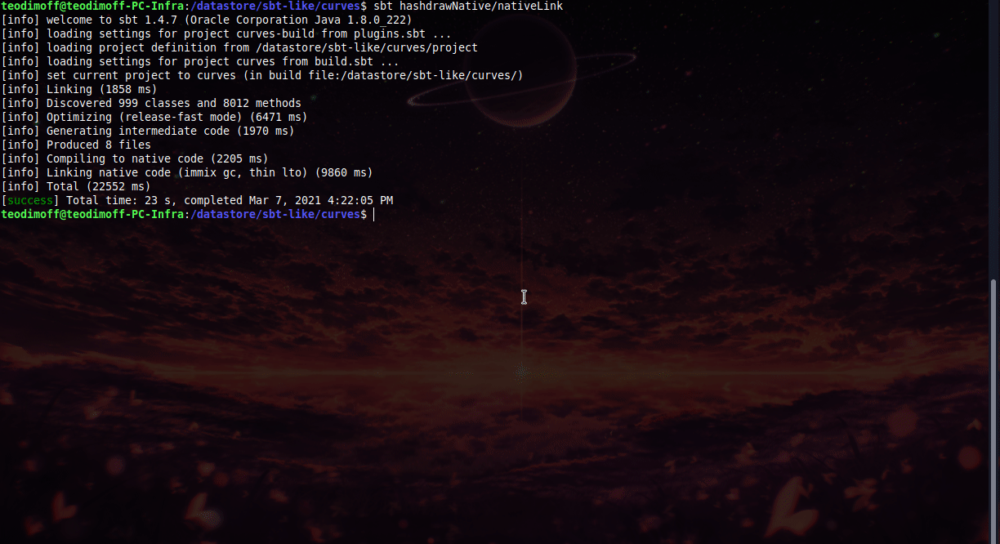

# ~ Curves ~
## Curves provide [Hilbert](https://en.wikipedia.org/wiki/Hilbert_curve)   mapping of a **point** from 1D to 2D hilbert space. This means that points closer together from one dimentional space are closer in the other. In other words it preserves locality. 
## Curves also provide drawing to visualize datapoints, created from hash functions.
- [Scala-Native](https://github.com/scala-native/scala-native) with the use of SDL2
- Online javascript: https://teodimoff.github.io/curves/
- more to come

## Compile
```scala
sbt "hashdrawNative/nativeLink" 
```
## install SDL2
### taken form: [here](https://gist.github.com/BoredBored/3187339a99f7786c25075d4d9c80fad5#file-how-to-install-sdl-on-ubuntu-md)
```batch
#install sdl2
sudo apt install libsdl2-dev libsdl2-2.0-0 -y;

#install sdl image  - if you want to display images
sudo apt install libjpeg-dev libwebp-dev libtiff5-dev libsdl2-image-dev libsdl2-image-2.0-0 -y;

#install sdl mixer  - if you want sound
sudo apt install libmikmod-dev libfishsound1-dev libsmpeg-dev liboggz2-dev libflac-dev libfluidsynth-dev libsdl2-mixer-dev libsdl2-mixer-2.0-0 -y;

#install sdl true type fonts - if you want to use text
sudo apt install libfreetype6-dev libsdl2-ttf-dev libsdl2-ttf-2.0-0 -y;
```


## Examples

```scala
./example/hashdraw/native/target/scala-2.13/hashdraw-out primes
```
```scala
./example/hashdraw/native/target/scala-2.13/hashdraw-out murmur3 
```
```scala
./example/hashdraw/native/target/scala-2.13/hashdraw-out hashCode 200000 10 white 
```


## File Distribution
```scala
./example/hashdraw/native/target/scala-2.13/hashdraw-out test.gif
```

